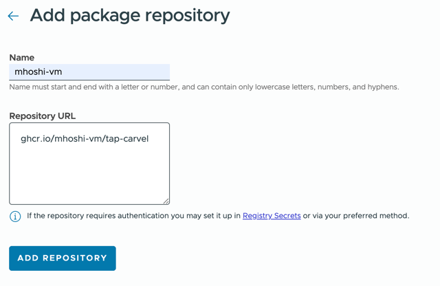
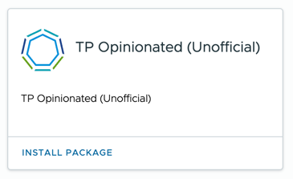
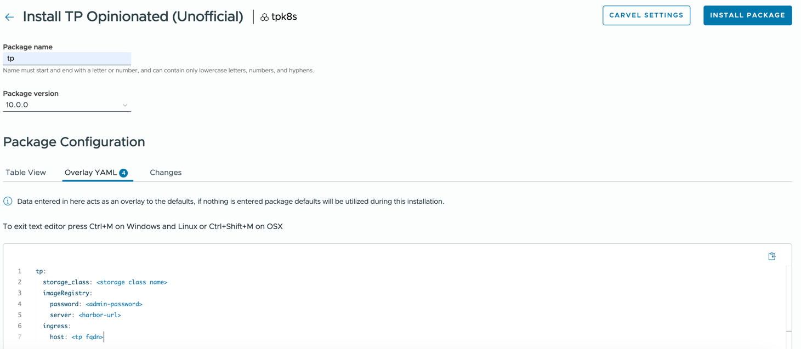

# Unofficial Tanzu Platform for K8S opinionanted carvel installer

A unofficial version on the Tanzu Platform for k8s installer. No support included.

## Features
- No `tanzu-sm-installer` cli = Better for gitops and/or can be installed via TMC
- Installs cert-manager automatically
- Installs and configures openldap for removing OIDC dependency
- No plain text secrets needed for `config.yaml` (better for gitops)
- Footprint reduced using [several hacks](10.0.0/hacks) to 2 Nodes with 12 vCPU / 32 GB Memory

## Prereq
- Prepare TKGs/m with the following size by minimum
  - 1 control nodes with 2vCPU, 8GB Memory 
  - 2 Nodes with 12 vCPU, 32 GB Memory, 200GB mounted on /var/lib/containerd 
- Complete `Download and stage the installation images` step only in [installation guide](https://techdocs.broadcom.com/us/en/vmware-tanzu/platform/tanzu-platform/10-0/tnz-platform/tp-sm-install-install-tp-sm.html)

## How to install 

### tanzu cli

Step 1 : install package repo

```
kubectl create ns tap-carvel
tanzu package repository add mhoshi-vm -n tap-carvel --url ghcr.io/mhoshi-vm/tap-carvel:latest
```

Step 2 : prepare values.yaml
Check [parameters](10.0.0/values.yaml). Minimum required setting is the following
```
certmanager:
  package_repo:
    install: true
tp:
  storage_class: <storage class name>
  imageRegistry:
    password: <admin-password>
    server: <harbor-url>
  ingress:
    host: <tp fqdn>
```

Step 3 : Deploy, wait and enjoy
```
tanzu package install tp -p tpk8s-opinionated.tanzu.japan.com --version 10.0.0 --values-file values.yaml -n tap-carvel
```

### TMC

Step 1 : From [Add-Ons] > [Tanzu repositores] choose [Add package repository] with the following paramter
```
Name: mhoshi-vm
Repository URL:
ghcr.io/mhoshi-vm/tap-carvel
```


---

Step 2 : From [Add-Ons] > [Installed Tanzu Packages] choose [Browse Packages] and find [TP Opinionated (Unofficial)] 


---

Step 3: Install package. Package name can be anything, for Overlay YAML, by minimum add the following, wait and enjoy
```
tp:
  storage_class: <storage class name>
  imageRegistry:
    password: <admin-password>
    server: <harbor-url>
  ingress:
    host: <tp fqdn>
```


---