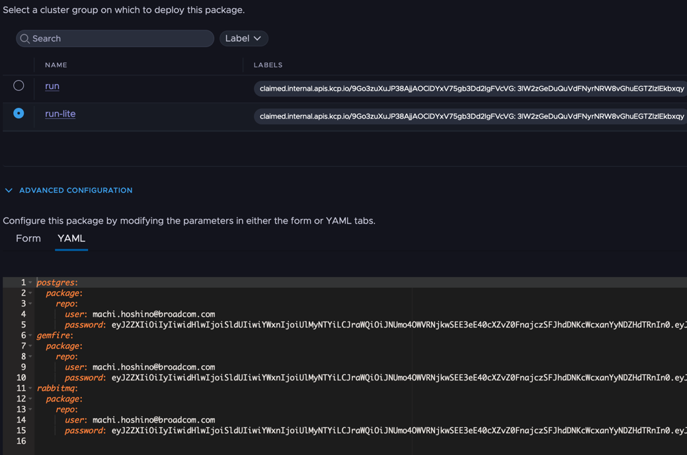

# Install at project level

```
tanzu project use
```

```ecma script level 4
tanzu package repository add mhoshi-vm --url ghcr.io/mhoshi-vm/tap-carvel:latest
```

# Install at ClusterGroup Level

```
tanzu operations clustergroup use 
```

```
tanzu package repository add mhoshi-vm --url ghcr.io/mhoshi-vm/tap-carvel:latest
```

# Install capabilites

